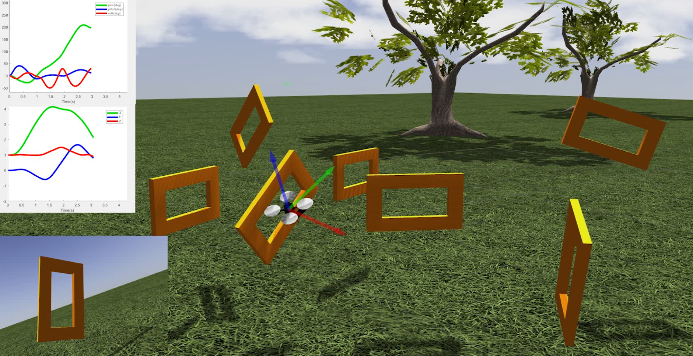

# Optimal Control for UAVs using GPOPS-II  #

Author: Jesus Tordesillas

This repo has the code to solve the optimal control problem to obtain a trajectory for a quadrotor passing through several predefined gates. A description of the approach can be found [here](https://dspace.mit.edu/handle/1721.1/122420):

A video is available [here](https://www.youtube.com/watch?v=-YY_0Ib-o_4):

[](https://www.youtube.com/watch?v=-YY_0Ib-o_4 "Optimal Path Planning for a UAV using GPOPS-II") 

## Citation
When using this code, please cite the following thesis:

```bibtex
@mastersthesis{tordesillas2019trajectory,
  title={Trajectory planner for agile flights in unknown environments},
  author={Tordesillas Torres, Jesus},
  year={2019},
  school={Massachusetts Institute of Technology}
}
```


## Instructions:
Install [GPOPS-II](http://www.gpops2.com/). Then clone this repository:
```
git clone https://github.com/jtorde/drone_racing_gpops
```
and execute the file `src/main.m` in MATLAB


## License
BSD 3-Clause, see License file attached
